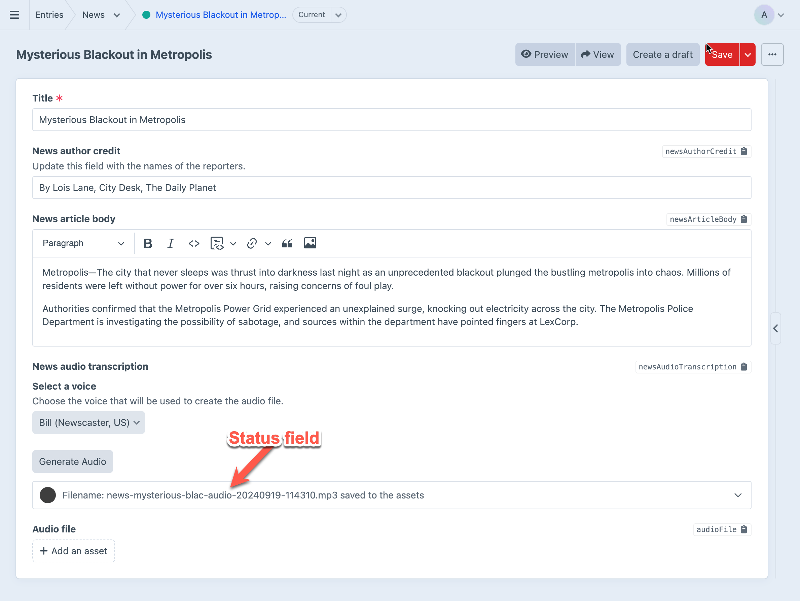

# Bespoken Documentation

The Bespoken plugin for Craft CMS allows you to create audio files from text fields in your Craft CMS entries. The instructions for setting it up are included inline within the plugin itself. This document provides a single page version to help give a consolidated view of the plugin's features and how to set it up.

## Set up the plugin

Here are the basic steps in setting up the Bespoken plugin:

1. [Create an account with ElevenLabs](https://elevenlabs.io/?from=partnergomez2285) and get your API key. This key is found in the [control panel](https://elevenlabs.io/app/speech-synthesis/text-to-speech) in the _My Account_ menu.
2. Add your API key to the plugin settings page.
3. Choose a voice model for your site. See the [ElevenLabs documentation](https://elevenlabs.io/docs/speech-synthesis/models) for more information about the models. 
4. Customize the voices available on your site. You can include as many as you want. The voice ID in the Bespoken settings page is the ID from ElevenLabs in the [Voice Lab](https://elevenlabs.io/app/voice-lab). The Voice Lab page will also provide a name for the voice, but the name you use does not have to be the same.
5. Create a set of custom pronunciations for unique words used in your site. This is optional but can be useful if you have a lot of unique words that the voice model may not pronounce correctly. Take the word DDEV, for example. The AI voice model may pronounce it as "d-d-e-v" instead of "dee dev". The pronunciation list swaps out the original word with a phonetic spelling that the voice model will pronounce correctly.  
6. Create an Asset volume to store the audio files and choose it in the plugin settings. This volume should have a publicly accessible URL. Since this is a normal [Craft CMS Asset](https://craftcms.com/docs/5.x/reference/element-types/assets.html) volume, the filesystem can be [local](https://craftcms.com/docs/5.x/reference/element-types/assets.html#local-filesystems) or [remote](https://craftcms.com/docs/5.x/reference/element-types/assets.html#remote-filesystems).
7. Leave the Advanced settings as they are unless you have a specific need to change them.

## Bespoken field

Once the setup is complete. Create a Bespoken field for the Entry Type you want to narrate. 

1. Create a new field in Craft.
2. Choose the Bespoken field type.
3. Choose at least one `fieldHandle` from the entry type to narrate. Bespoken supports CKEditor fields and Plain Text fields. (See below for information on how the text from fields is processed.) Multiple field handles can be included, separated by commas. Consider including the `title` field as your first field.
4. Optionally, you can provide a prefix for the filename of your audio file. This can be useful if there are multiple instances of Bespoken fields in your entry type.
5. Choose at least one voice for the field. 

### Example of the settings for a Bespoken plugin


### Example of the field set up for a Bespoken plugin


The Bespoken field has a status field that will show the status of the audio file creation. It will display the name of the audio file when the file is created. If there is an error, the status field will display the error message. 

### Example of a successful audio file creation



### Example of an error audio file creation

In this example, you can see that the audio file creation failed because there were not enough credits left in the ElevenLabs account to create the audio file.


### How text is processed from a CKEditor field

The Bespoken plugin processes text from a CKEditor field by stripping out the HTML tags added by the CKEditor field and converting the text to plain text. This means that the audio file will not include any HTML tags.

Only the text content of the CKEditor field is processed. Any other content, such as images or links, will not be included in the audio file.

If there are embedded entries or assets in the CKEditor field, the Bespoken plugin will not process them. The audio file will only include the text content of the CKEditor field.

### How text is processed from a Plain Text field

The Bespoken plugin processes text from a Plain Text field as is but without line breaks. Since line breaks visually indicate a pause, the Bespoken plugin will add a period to line breaks that do not end with a period. This will help the AI voice model to pause at the end of a line of text.

## Excluding elements from the audio file

The Bespoken plugin allows you to exclude elements from the audio file by adding the class `bespoken-exclude` to the element. This feature is useful for excluding elements like code blocks from the audio file. 

### Example of excluding elements from the audio file with a CKEditor field

For this example, imagine you have a CKEditor field with the following content. 


We have two goals for this content.

1. The code block should be excluded from the audio file.
2. The first paragraph should only be used for the audio file. It should not be displayed on the frontend of the site.

_Tip: I use this on my own site to exclude code blocks from the audio files. I find it useful for posts that include a lot of code. I use the `bespoken-only` class to announce to a listener that a code block has been excluded from the audio version and to see the written blog post for the full code example._

The HTML for this content would look like this.

```html
<p>This is a paragraph.</p>
<pre>
  <code>
    This is a code block.
  </code>
</pre>
<p>This is another paragraph.</p>
```

To accomplish our goals, we want to add the class `bespoken-exclude` to the code block and the class `bespoken-only` to the first paragraph. That would result in HTML that looks like this.

```html
<p class="bespoken-only">This is a paragraph.</p>
<pre class="bespoken-exclude">
  <code>
    This is a code block.
  </code>
</pre>
<p>This is another paragraph.</p>
```

You could use the CKEditor's Source button to edit the HTML directly to add these classes, but ideally your content authors never have to write HTML when creating a post in Craft CMS.

Instead, we'll create a CKEditor Config that adds a button to the CKEditor toolbar that allows content authors to add the `bespoken-exclude` and `bespoken-only` classes to elements in the CKEditor field.


In the _Config Options_, define two new style rules. One for the `bespoken-exclude` class and one for the `bespoken-only` class. In this example, only `pre` elements can have the `bespoken-exclude` class, and only `p` elements can have the `bespoken-only` class.

```json
{
  "style": {
    "definitions": [
      {
        "classes": [
          "bespoken-exclude"
        ],
        "element": "pre",
        "name": "Exclude from narration"
      },
      {
        "classes": [
          "bespoken-only"
        ],
        "element": "p",
        "name": "Narration only"
      }
    ]
  }
}
```

In the _Custom Styles_ section, define the styles for the `bespoken-exclude` and `bespoken-only` classes. In this example, the `bespoken-exclude` class will have a background color of red, and the `bespoken-only` class will have a background color of blue. We use the `::before` pseudo-element to add a label to the excluded elements.

```css
.ck.ck-content .bespoken-exclude * {
  color: red;
}

.ck.ck-content .bespoken-exclude::before {
  content: "Code block excluded from narration";
  display: inline-block;
  margin-top: -8px;
  margin-bottom: 8px;
  padding: 2px 4px;
  border-radius: 2px;
  font-size: 10px;
  color: black;
  border: 1px solid rgb(199, 189, 189);
  background-color: rgb(253, 248, 240);
}


.ck.ck-content .bespoken-only {
  color: blue;
}

.ck.ck-content .bespoken-only::before {
  content: "Narration only";
  color: black;
  display: inline-block;
  background-color: rgb(253, 248, 240);
  padding: 2px 4px;
  margin-right: 4px;
  border-radius: 2px;
  font-size: 10px;
  border: 1px solid rgb(199, 189, 189);
}
```

These CSS styles are **only** for the CKEditor field and will not affect the front end of your site. The styles are used to visually indicate to the content author which elements are excluded from the audio file.

For the frontend of your site, you will need to add CSS styles to hide the elements with the `bespoken-exclude` class. 

```css
.bespoken-exclude {
  display: none;
}
```

These classes give your content authors a visual indication of which elements are excluded from the audio file. They also now have more control of the audio they create with the Bespoken plugin.

## About the Craft CMS queue and Bespoken audio file creation

The Bespoken plugin uses the Craft CMS queue to process the audio files. Read more about the Craft CMS Queue system in the Craft [https://craftcms.com/docs/5.x/system/queue.html). Ideally, the queue should be set up to run automatically in the background.

Relying on the queue system means that the audio files are created in the background and may take some time to appear in your Asset volume. If your queue is not running, the audio files will not be created.

If your queue is running automatically in the background via [CRON job or daemon](https://craftcms.com/docs/5.x/system/queue.html#queue-runners), the field type will update with the status of your audio file. 

If the queue is run only on [HTTP](https://craftcms.com/docs/5.x/system/queue.html#http), the queue may not run until you refresh the page.
